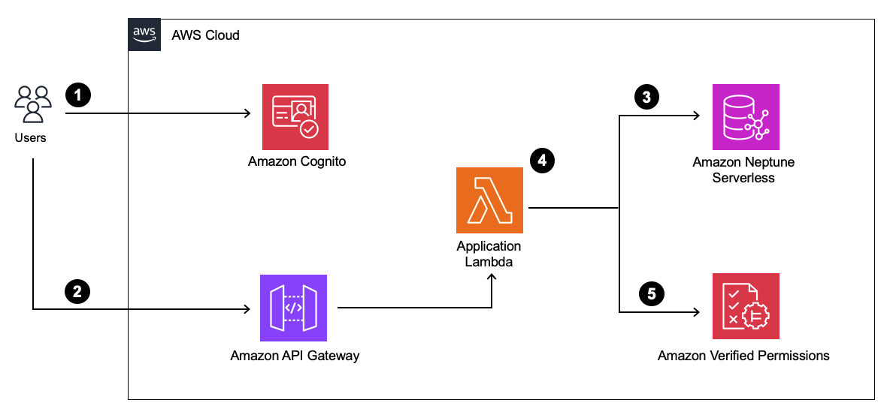
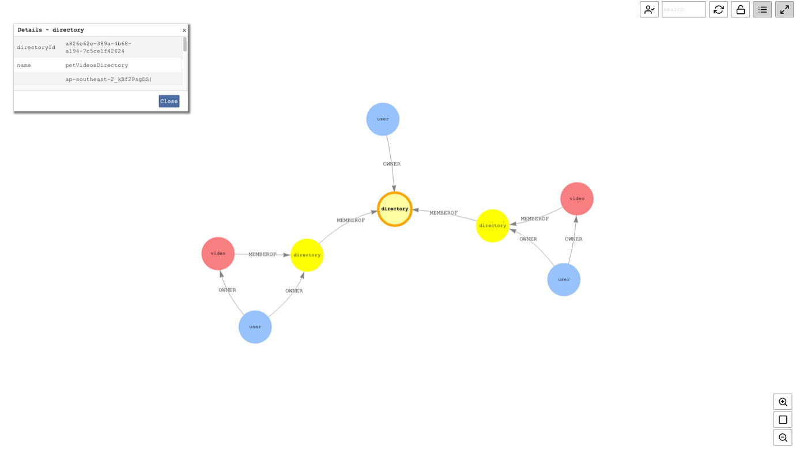
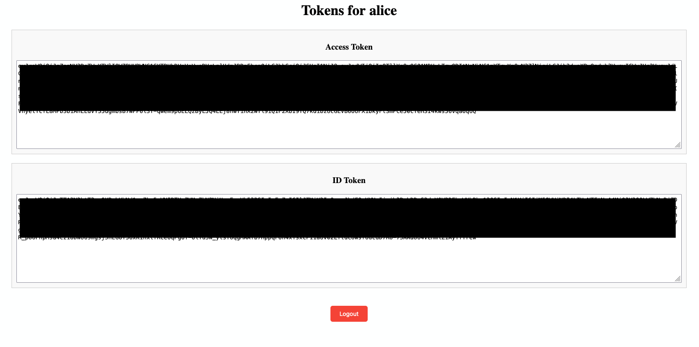

# How to implement relationship-based access control with Amazon Verified Permissions and Amazon Neptune

## Introduction

This repository provides an [AWS CloudFormation](https://aws.amazon.com/cloudformation/) template that deploys a sample application demonstrating the implementation of Relationship-based Access Control (ReBAC) using [Amazon Verified Permissions](https://aws.amazon.com/verified-permissions/) and [Amazon Neptune](https://aws.amazon.com/neptune/), a managed, serverless graph database on AWS. For details about ReBAC, you may refer to the blog post ["How to Implement Relationship-based Access Control with Amazon Verified Permissions and Amazon Neptune"](https://aws.amazon.com/blogs/security/how-to-implement-relationship-based-access-control-with-amazon-verified-permissions-and-amazon-neptune/).

## Table of Content

1.  [Introduction](#introduction)
2.  [Overview of a ReBAC application](#overview-of-a-rebac-application)
3.  [Prerequisites](#prerequisites)
4.  [Deployment on AWS](#deployment-on-aws) 
5.  [Walkthrough](#walkthrough)
    - [Bootstrap the solution](#bootstrap-the-solution) 
    - [Cedar policy design](#cedar-policy-design)
    - [Obtain access tokens and ID tokens for each user](#obtain-access-tokens-and-id-tokens-for-each-user)
    - [Access Amazon API Gateway with access tokens and ID tokens](#access-amazon-api-gateway-with-access-tokens-and-id-tokens)
6.  [Extending ReBAC’s capabilities with Attribute-based Access Control (ABAC)](#extending-rebacs-capabilities-with-attribute-based-access-control-abac)
7.  [Cleaning up](#cleaning-up)
8.  [Conclusion](#conclusion)

## Overview of a ReBAC application

In this solution, relationship data is stored in Neptune. Prior to requesting an authorization decision from Verified Permissions, the application runs a Neptune query that traverses the relationship graph to retrieve the set of principals that have a specific relationship with the resource. The application then constructs an authorization request for Verified Permissions, using the results of this query to populate the entity data in the request.

In the Cedar schema, the resource has an attribute—named for the relationship—that contains the set of principals that have that relationship with the resource. In our sample application, entities of type Video have an attribute called `OWNER`, which contains the set of users that have an owner relationship, directly or indirectly, with a video. Each potential relationship is represented by a distinct resource attribute and requires a dedicated query to fetch the set of principals that have that relationship. 



1.	The user authenticates with [Amazon Cognito](https://aws.amazon.com/cognito/) and obtains an access token and an ID token.
2.	The user accesses the application via [Amazon API Gateway](https://aws.amazon.com/api-gateway/) with the provided token.
3.	An application [AWS Lambda](https://aws.amazon.com/lambda) function traverses the relationship graph in Neptune and returns the set of principals that have a specific relationship with the resource.
4.  The application Lambda function constructs the requests by putting relationship data in the entities field and passes the requests to Verified Permissions. Verified Permissions acts as the policy decision point (PDP) and evaluates the Cedar policies to arrive at an authorization decision.
5.  The application Lambda function acts as the policy enforcement point (PEP) to enforce the authorization decision returned by Verified Permissions by allowing or denying access to the API.

## Prerequisites

To complete this solution, make sure you meet the following prerequisites: 

* An AWS account with necessary IAM permissions to manage AWS resources including Amazon Verified Permissions, Amazon Neptune, Amazon Cognito, AWS Lambda, Amazon CloudWatch, and Amazon API Gateway.
* An active terminal.

## Deployment on AWS

1.  Sign in to your AWS account.
2.  Navigate to `us-east-1` region.
3.  Download the CloudFormation template file [here](/cloudformation-template/avp-rebac-blog-template.yaml).
4.	Upload the CloudFormation template file in the [CloudFormation create stack page](https://console.aws.amazon.com/cloudformation/home#/stacks/create/template) to deploy the solution.
5.	Enter a name for the CloudFormation stack (for example `aws-blog-avp-rebac`).
6.  Select **I acknowledge that AWS CloudFormation might create IAM resources with custom names.** at the last step of stack creation.
7.  Choose **Submit**. The CloudFormation stack creation process takes around 15–20 minutes to complete.

## Walkthrough

### Bootstrap the solution

Before walking through the solution, package `gremlinpython 3.7.2` as a Lambda Layer for Lambda functions. A Lambda layer is a .zip file archive that contains supplementary code or data. Layers usually contain library dependencies, a custom runtime, or configuration files. For more information about Lambda Layer, please refer to this [link](https://docs.aws.amazon.com/lambda/latest/dg/chapter-layers.html).

1. In your terminal, navigate to the `lambda-layer` directory of the repository. This directory contains the scripts that you use to create and package the layer properly.

```
cd implementing-relationship-based-access-control-with-amazon-verified-permissions-and-amazon-neptune/lambda-layer
```

2. Examine the requirements.txt file. This file defines the dependencies that you want to include in the layer, namely the `gremlinpython` library. You can update this file to include any dependencies that you want to include in your own layer.

```
gremlinpython==3.7.2
```

3. Ensure that you have permissions to run both scripts.

```
chmod 744 1-install.sh && chmod 744 2-package.sh
```

4. Run the 1-install.sh script using the following command:

```
./1-install.sh
```

This script uses venv to create a Python virtual environment named `create-gremlinpython-layer`. It then installs all required dependencies in the `create-gremlinpython-layer/lib/python3.9/site-packages` directory.

**Example 1-install.sh**
```
python3.9 -m venv create-gremlinpython-layer
source create-gremlinpython-layer/bin/activate
pip install -r requirements.txt
```

5. Run the 2-package.sh script using the following command:

```
./2-package.sh
```

This script copies the contents from the `create-gremlinpython-layer/lib` directory into a new directory named `python`. It then zips the contents of the `python` directory into a file named `gremlinpython-layer.zip`. This is the .zip file for your layer. You can unzip the file and verify that it contains the correct file structure, as shown in the Layer paths for Python runtimes section.

**Example 2-package.sh**
```
mkdir python
cp -r create-gremlinpython-layer/lib python/
zip -r gremlinpython-layer.zip python
```

6. Create the Lambda Layer using the following command:

```
aws lambda publish-layer-version --layer-name gremlinpython-layer \
    --zip-file fileb://gremlinpython-layer.zip \
    --compatible-runtimes python3.9 \
    --compatible-architectures "x86_64"
```

Take note of the Amazon Resource Name (ARN) of the Lambda Layer from the response, which looks like `arn:aws:lambda:us-east-1:123456789012:layer:python-requests-layer:1`.

7. Add the layer to the Lambda Functions `avp-rebac-blog-PetVideosAppApiLambda` and `avp-rebac-blog-PetVideosAppBootstrapLambda` using the below commands, replace the layer ARN with the response from the previous step:

```
aws lambda update-function-configuration --function-name avp-rebac-blog-PetVideosAppApiLambda \
    --cli-binary-format raw-in-base64-out \
    --layers "arn:aws:lambda:us-east-1:123456789012:layer:python-requests-layer:1"
```

```
aws lambda update-function-configuration --function-name avp-rebac-blog-PetVideosAppBootstrapLambda \
    --cli-binary-format raw-in-base64-out \
    --layers "arn:aws:lambda:us-east-1:123456789012:layer:python-requests-layer:1"
```

8. Invoke the Lambda Function `avp-rebac-blog-PetVideosAppBootstrapLambda` to bootstrap the solution with the following:

```
aws lambda invoke --function-name avp-rebac-blog-PetVideosAppBootstrapLambda \
    --cli-binary-format raw-in-base64-out \
    response.json
```

9. Navigate to the Neptune graph notebook from your AWS console, and open JupyterLab from `Actions`. Open a new `Python 3` notebook.

10. Visualize the relationship graph bootstrapped in Neptune with the following query:

```
%%gremlin -p v,oute,inv 

g.V().outE().inV().path().by(elementMap('name','directoryId','videoId','ownerName','ownerId','userId','isPublic').order().by(keys))
```

The below shows the relationship graph for this sample application.



### Cedar policy design

Verified Permissions uses the [Cedar policy language](https://docs.aws.amazon.com/verifiedpermissions/latest/userguide/what-is-avp.html#avp-cedar) to define fine-grained permissions. The default decision for an authorization response is `DENY`. The first policy permits a principal to perform actions in the action group `OwnerActions` on resources in `petVideosDirectory` only when the same principal is included in the set of resource owners.

```
// Resource owner and related persons can access the resources
permit (
    principal,
    action in [PetVideosApp::Action::"OwnerActions"],
    resource in PetVideosApp::Directory::<petVideosDirectory_UUID> ) 
when { 
    resource has owner && 
    principal in resource.owner };
```

The second policy is an ABAC policy that permits a principal to perform actions in the action group `PublicActions` on resources in `petVideosDirectory` only when the resource has the static attribute `isPublic` and its value is `true`.

```
// Allow public access to the resources
permit (
    principal,
    action in [PetVideosApp::Action::"PublicActions"], 
    resource in PetVideosApp::Directory::<petVideosDirectory_UUID> ) 
when { 
    resource has isPublic &&
    resource.isPublic == true }; 
```

The blog post ["How to Implement Relationship-based Access Control with Amazon Verified Permissions and Amazon Neptune"](https://aws.amazon.com/blogs/security/how-to-implement-relationship-based-access-control-with-amazon-verified-permissions-and-amazon-neptune/) has provided some guidelines and considerations for desiging your policies and queries for a ReBAC application.

### Obtain access tokens and ID tokens for each user

1. First go to the CloudFormation console, on the stack Outputs tab, find the below values:
    - ApiEndpoint
    - LoginPage
    - PasswordforCognitoUser
2. Go to the LoginPage, login as `alice`, `bob`, and `charlie`. Enter the password obtained in Step 1.
3. Copy and paste the access token and ID token for each user.



4. Open your terminal, export the ApiEndpoint, access token and ID token for `alice`, `bob`, and `charlie` as variables with the below:

```
export API_ENDPOINT=<ApiEndpoint>

export ACCESS_TOKEN_ALICE=<access token for alice>
export ID_TOKEN_ALICE=<id token for alice>

export ACCESS_TOKEN_BOB=<access token for bob>
export ID_TOKEN_BOB=<id token for bob>

export ACCESS_TOKEN_CHARLIE=<access token for charlie>
export ID_TOKEN_CHARLIE=<id token for charlie>
```

### Access Amazon API Gateway with access tokens and ID tokens

First, to test an authenticated user accessing their own resources, access the video `aliceCatVideo.mp4` with the `ViewVideo` API in your terminal, and using the access token and ID token of `alice`. It is expected to be successful with the Cedar policy `Resource owner and related persons can access the resources`.

```
curl -X GET "$API_ENDPOINT/video/get?videoName=aliceCatVideo.mp4" -H "Authorization: Bearer $ACCESS_TOKEN_ALICE" -H "ID-Token: $ID_TOKEN_ALICE" | jq
```

The application Lambda function constructs the below authorization request to Amazon Verified Permissions, and sends logs to [Amazon CloudWatch](https://aws.amazon.com/cloudwatch/). You may examine the authorization request in the CloudWatch Log Group of the application Lambda function. An example of authorization requests made to Amazon Verified Permissions is shown below.

```
{
    "policyStoreId": "HhuNNuHBJJYJd4MfEhAZzD",
    "identityToken": [ID Token Redacted],
    "action": {
        "actionType": "PetVideosApp::Action",
        "actionId": "ViewVideo"
    },
    "resource": {
        "entityType": "PetVideosApp::Video",
        "entityId": "878c101a-ca0e-4733-904d-af3f252abf50"
    },
    "entities": {
        "entityList": [
            {
                "identifier": {
                    "entityType": "PetVideosApp::Video",
                    "entityId": "878c101a-ca0e-4733-904d-af3f252abf50"
                },
                "attributes": {
                    "owner": {
                        "set": [
                            {
                                "entityIdentifier": {
                                    "entityType": "PetVideosApp::User",
                                    "entityId": "ap-southeast-2_K9khoza7q|696e7428-e021-708d-7996-2d322fcf4b29"
                                }
                            },
                            {
                                "entityIdentifier": {
                                    "entityType": "PetVideosApp::User",
                                    "entityId": "ap-southeast-2_K9khoza7q|f91eb468-2001-7080-b860-eff8e20c333c"
                                }
                            }
                        ]
                    },
                    "isPublic": {
                        "boolean": false
                    }
                },
                "parents": [
                    {
                        "entityType": "PetVideosApp::Directory",
                        "entityId": "8e46133a-18da-47dc-bb7c-5e8640f45043"
                    },
                    {
                        "entityType": "PetVideosApp::Directory",
                        "entityId": "5e732639-692b-4fb0-8b69-d305926144fe"
                    }
                ]
            }
        ]
    }
}
```

There are several things to take note in the above authorization request:
- **identityToken**: When using Cognito as the identity store with Verified Permissions, access token or ID token can be used as the principal to make authorization requests. User entities are mapped into the format of `<user pool ID>|<sub>` in Verified Permissions.
- **action**: This authorization request is made against the action `ViewVideo`.
- **resource**: This authorization request is made against a specific video ID.
- **entities**: 
  - The entities of type `video` have an attribute named for the relationship `OWNER`. Two owner IDs, which denote `alice` and `charlie`, are returned by traversing the relationship graph in Neptune. Both IDs are included as `owner` attribute, showing the direct and inherited `OWNER` relationship between the principals and resources.
  - There is a static attribute `isPublic` set as `false` for this video resource, which denotes it is a private video.
  - The resource hierarchy of this video resource is shown by including the parent directories `petVideosDirectory` and `aliceVideosDirectory` as the parent entities.

The below response is returned from the application, showing access is allowed with the determining policy ID, which matched the Cedar policy ID of `<Resource owner and related persons can access the resources>`.

```
{
  "message": "Access allowed -- determining policy id is Hqm41Phz4JVKNKhmUofB4T"
}
```

Now, to test an authenticated user accessing others’ resources, access the video `aliceCatVideo.mp4` with the `ViewVideo` API, and using the access token and ID token of `bob`.

```
curl -X GET "$API_ENDPOINT/video/get?videoName=aliceCatVideo.mp4" -H "Authorization: Bearer $ACCESS_TOKEN_BOB" -H "ID-Token: $ID_TOKEN_BOB" | jq
```

It is expected to fail as `bob` had no direct or inherited `OWNER` relationship with the video `aliceCatVideo.mp4`.

```
{
  "message": "Access denied -- permissions check failed"
}
```

Finally, to test the inherited `OWNER` relationship between user `charlie` and video `aliceCatVideo.mp4`, access the video `aliceCatVideo.mp4` with the `ViewVideo` API, and using the access token and ID token of `charlie`.

```
curl -X GET "$API_ENDPOINT/video/get?videoName=aliceCatVideo.mp4" -H "Authorization: Bearer $ACCESS_TOKEN_CHARLIE" -H "ID-Token: $ID_TOKEN_CHARLIE" | jq
```

It is expected to be successful. This relationship inheritance is discovered through traversing the relationship graph from `aliceCatVideo.mp4` along to the permission boundary, in thie case, the root directory `petVideosDirectory`.

```
{
  "message": "Access allowed -- determining policy id is Hqm41Phz4JVKNKhmUofB4T"
}
```

## Combining ReBAC policies with Attribute-based Access Control (ABAC) policies

ReBAC policies are a great fit when you want to create access based on a relationship between the principal and the resource. However, there can be cases where an ABAC policy is a more intuitive expression of a business rule. For example, in the sample application, you might want to grant all principals permission to view any public resource. 

With ReBAC, we would need to create a vertex `public` in the relationship graph, create `MEMBEROF` relationships between all public resources and this vertex, and then create a `VIEWER` relationship between all principals and the vertex `public`.

With Cedar can create a policy store that is mix of ABAC and ReBAC policies, enabling you to express this access rule with a single ABAC policy that allows public access to resources, as described in the section [Cedar Policy Design](#cedar-policies-design). This policy grants broad access on any resource with the attribute `isPublic` set to `true`.

Now you can use the following Gremlin query to modify the static property `isPublic` of video resource vertex `bobDogVideo.mp4` to `true`.

```
# Set the property "isPublic" to "true" for a specific video
g.V().hasLabel('video').has('name','bobDogVideo.mp4').property(single,'isPublic',true)
```

You can verify the value of property `isPublic` of `bobDogVideo.mp4` with the following Gremlin query.

```
# Verify the value of property "isPublic" of a specific video
g.V().hasLabel('video').has('name','bobDogVideo.mp4').values('isPublic')
```

The below authorization request is made to Verified Permissions using principal `alice` after we have set the `isPublic` property of video resource `bobDogVideo.mp4`. Please note that `alice` has no direct or inherited `OWNER` relationship to the resource `bobDogVideo.mp4`.

```
curl -X GET "$API_ENDPOINT/video/get?videoName=bobDogVideo.mp4" -H "Authorization: Bearer $ACCESS_TOKEN_ALICE" -H "ID-Token: $ID_TOKEN_ALICE" | jq
```

The following authorization request is made to Verified Permissions using principal `alice` after you have set the `isPublic` property of video resource `bobDogVideo.mp4`. In the entities field, there is the attribute `isPublic` with `true` as the value. With reference to the Cedar policy `<Allow public access to the resources>`, the following authorization request returns `ALLOW`. 

```
{
    "policyStoreId": "HhuNNuHBJJYJd4MfEhAZzD",
    "identityToken": [ID Token Redacted],
    "action": {
        "actionType": "PetVideosApp::Action",
        "actionId": "ViewVideo"
    },
    "resource": {
        "entityType": "PetVideosApp::Video",
        "entityId": "8646429e-dca1-4229-aa26-9afcf75f053b"
    },
    "entities": {
        "entityList": [
            {
                "identifier": {
                    "entityType": "PetVideosApp::Video",
                    "entityId": "8646429e-dca1-4229-aa26-9afcf75f053b"
                },
                "attributes": {
                    "owner": {
                        "set": [
                            {
                                "entityIdentifier": {
                                    "entityType": "PetVideosApp::User",
                                    "entityId": "ap-southeast-2_K9khoza7q|b99ee448-f081-7078-5343-826a680f781f"
                                }
                            },
                            {
                                "entityIdentifier": {
                                    "entityType": "PetVideosApp::User",
                                    "entityId": "ap-southeast-2_K9khoza7q|f91eb468-2001-7080-b860-eff8e20c333c"
                                }
                            }
                        ]
                    },
                    "isPublic": {
                        "boolean": true
                    }
                },
                "parents": [
                    {
                        "entityType": "PetVideosApp::Directory",
                        "entityId": "b1551923-838e-43dc-946c-9fc63a85f445"
                    },
                    {
                        "entityType": "PetVideosApp::Directory",
                        "entityId": "5e732639-692b-4fb0-8b69-d305926144fe"
                    }
                ]
            }
        ]
    }
}
```

## Cleaning Up

To avoid incurring future charges, make sure to clean up all the AWS resources that you created as part of this post. Follow the below the clean up the resources:

1. Remove the VPC access of AWS Lambda `avp-rebac-blog-PetVideosAppBootstrapLambda` and `avp-rebac-blog-PetVideosAppApiLambda` with the following:

```
aws lambda update-function-configuration --function-name avp-rebac-blog-PetVideosAppBootstrapLambda --vpc-config SubnetIds=[],SecurityGroupIds=[] && aws lambda update-function-configuration --function-name avp-rebac-blog-PetVideosAppApiLambda --vpc-config SubnetIds=[],SecurityGroupIds=[]
```

2. Verify the Elastic Network Interfaces of both Lambdas are deleted:

```
aws ec2 describe-network-interfaces --filters "Name=interface-type,Values=lambda"
```

3. After that you can delete the CloudFormation stack with the following:

```
aws cloudformation delete-stack --stack-name <stack name>
```

## Conclusion

In this post, we showed you what ReBAC is and its benefits and demonstrated the implementation of ReBAC using Amazon Verified Permissions and Amazon Neptune. We also reviewed Cedar policy design patterns and considerations, in addition to the authorization request structure for a ReBAC application. You also saw how to combine ReBAC policies with ABAC policies. 

Refer to the links here to learn more about [Cedar Policies](https://docs.cedarpolicy.com/), [Amazon Verified Permissions](https://docs.aws.amazon.com/verifiedpermissions/latest/userguide/what-is-avp.html), and [Amazon Neptune](https://docs.aws.amazon.com/neptune/latest/userguide/intro.html).

## Security

See [CONTRIBUTING](CONTRIBUTING.md) for more information.

## License

This library is licensed under the MIT-0 License. See the [LICENSE](LICENSE) file.